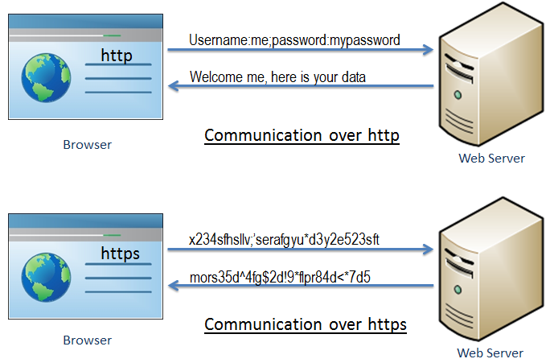

## What is https

>From https://www.tutorialsteacher.com/https/what-is-https

HTTPS stands for Hyper Text Transfer Protocol Secure. It is a protocol for securing the communication between two systems e.g. the browser and the web server.

The following figure illustrates the difference between communication over http and https:

As you can see in the above figure, http transfers data between the browser and the web server in the hypertext format, whereas https transfers data in the encrypted format.
Thus, https prevents hackers from reading and modifying the data during the transfer between the browser and the web server.
Even if hackers manage to intercept the communication, they will not be able to use it because the message is encrypted.

HTTPS established an encrypted link between the browser and the web server using the Secure Socket Layer (SSL) or Transport Layer Security (TLS) protocols. TLS is the new version of SSL.

## Secure Socket Layer(SSL)

SSL is the standard security technology for establishing an encrypted link between the two systems. These can be browser to server, server to server or client to server.
Basically, SSL ensures that the data transfer between the two systems remains encrypted and private.

The https is essentially http over SSL. SSL establishes an encrypted link using an SSL certificate which is also known as a digital certificate.

 